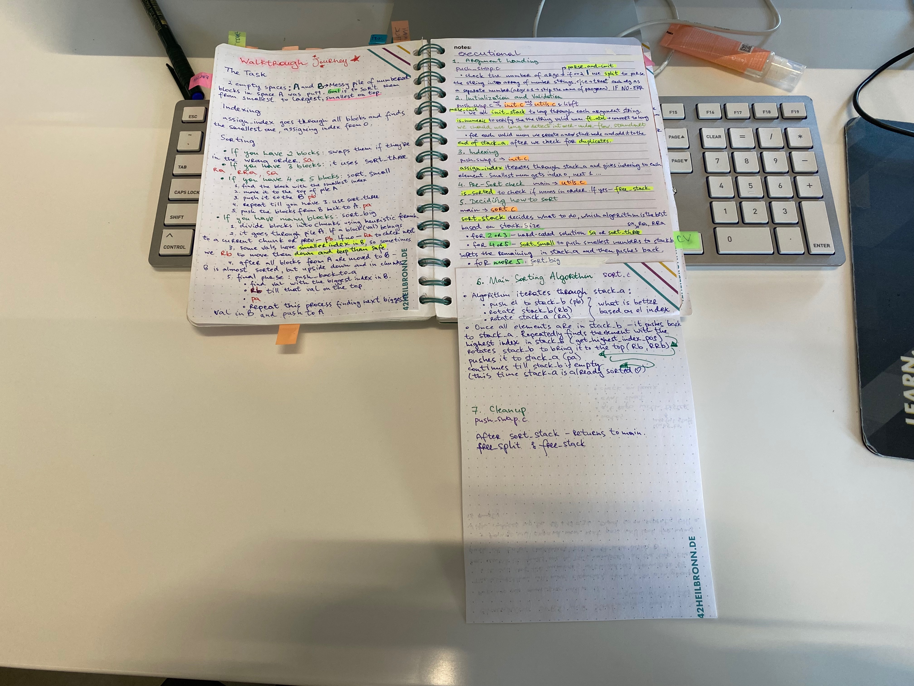
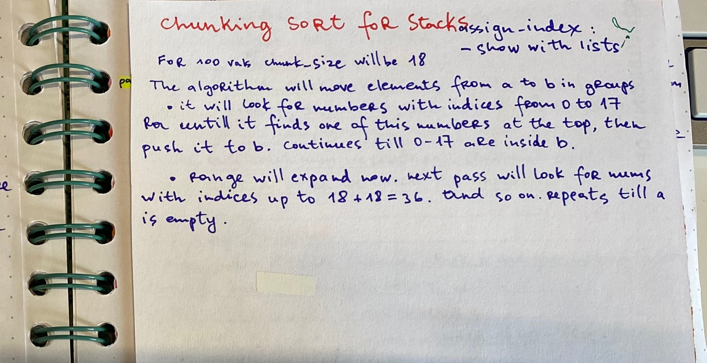

# Walkthrough Journey 🌟



## The Task
You have two empty spaces: **A** and **B** →  
A messy pile of numbered blocks is placed in space **A**.  
**Goal:** Sort them from **smallest to largest**, with the **smallest on top**.

---
## Indexing
The `assign-index` function:
- Goes through all blocks.
- Finds the smallest one.
- Assigns an index starting from `0`.

---
## Sorting

### **If you have 2 blocks**
- Swaps them if they’re in the wrong order. **Commands:**  `sa`
---
### **If you have 3 blocks**
- Uses `sort_three`. **Commands:** `ra, rra, sa`
---
### **If you have 4 or 5 blocks**
Sort them step-by-step:
1. Find the block with the **smallest index**.
2. Move it to the **top of pile A**.
3. Push it to **pile B** → `pb`
4. Repeat until only **3 blocks remain in A**.
5. Use `sort_three` on the remaining 3.
6. Push the blocks back from **B** to **A** → `pa`
---
### **If you have many blocks** (`sort_big`)
1. **Divide blocks into chunks** using a heuristic formula.
Reference to chunck heuristic formula 

2. Go through pile **A**:
 - If a block (val) belongs to the **current chunk**,  
   perform either:
   ```
   ra
   ```
   or
   ```
   pb
   ```
 - If `pb` was used, check the next block:
   - Some values have a **smaller index in B**,  
     so sometimes we use `rb` to move them **down** and keep them safe.
3. After **all blocks from A** are moved to **B**,  
 pile **B** is **almost sorted** but:
 - Upside down
 - In chunks
4. **Final phase:** `push_back_to_a`
 - Find the block with the **largest index** in **B**.
 - Use `rb` until that value is **on top**.
 - Use `pa` to push it to **A**.
 - **Repeat this process**, finding the next biggest value in **B** and pushing it to **A**.
---
## Summary of Commands
| Command | Description |
|----------|-------------|
| `sa` | Swap top 2 blocks in **A** |
| `ra` | Rotate **A** (top goes to bottom) |
| `rra` | Reverse rotate **A** (bottom goes to top) |
| `pb` | Push top block from **A** to **B** |
| `pa` | Push top block from **B** to **A** |
| `rb` | Rotate **B** (top goes to bottom) |

---
## Visual Flow
1. Assign indexes → start from 0.
2. Handle small stacks:
 - 2 blocks → `sa`
 - 3 blocks → `sort_three`
 - 4 or 5 blocks → push smallest to B, sort, then push back.
3. For big stacks:
 - Divide into chunks → move chunk elements to B.
 - Sort B step-by-step using rotations.
 - Push sorted blocks back to A.
---

Happy sorting! 🎉

lovely big thanks to [@Raainshe](https://github.com/Raainshe/)

article, that helped me to understand a lot: [ofc from medium](https://medium.com/@brakebein42/k-distribution-sort-applied-to-the-push-swap-problem-ae2d96d68376)
